```python
import matplotlib.pyplot as plt
import pandas as pd

#Todas son con Eta 1

#define tiempo (float)(10000)//Tiempo final aunque aquí en realidad es adimensional
#define dt (float)(0.0001)//Paso en tiempo
#define Temperatura (float)(1)//Esto en realidad es energía pues hago T*k_b
#define dT (float)(0.001)//Paso de T*k_b
PosVel=pd.read_csv('Rk_Hist_dt00001.csv')
n, bins, patches = plt.hist(PosVel.loc[:,"z"], 157, density=True, facecolor='g', alpha=0.75)
plt.xlabel('P(z)')
plt.ylabel('z')
plt.title('Distribución Gaussiana')
plt.axis([-.05, .05, 0, 35])
plt.grid(True)
plt.show()
n, bins, patches = plt.hist(PosVel.loc[:,"Posicion"], 60, density=True, facecolor='g', alpha=0.75)
plt.xlabel('Posicion')
plt.ylabel('P(x)')
plt.title('Distribución de posiciones')
plt.axis([-4, 4, 0, 0.45])
plt.grid(True)
plt.show()
n, bins, patches = plt.hist(PosVel.loc[:,"Velocidad"], 100, density=True, facecolor='g', alpha=0.75)
plt.xlabel('Velocidad')
plt.ylabel('P(v)')
plt.title('Distribución de velocidades')
plt.axis([-4, 4, 0, 0.45])
plt.grid(True)
plt.show()
Equi=pd.read_csv('Rk_Equiparticion_dt00001.csv')
plt.figure(figsize=(25,3))
plt.plot(Equi.loc[:,"Temperatura"],Equi.loc[:,"Cinetica"])
plt.plot(Equi.loc[:,"Temperatura"],Equi.loc[:,"Potencial"])
plt.grid(True)
plt.show()
```


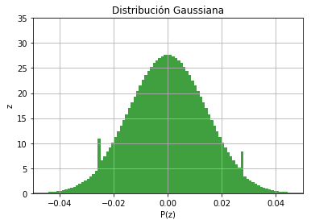


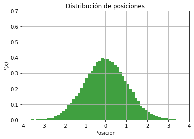


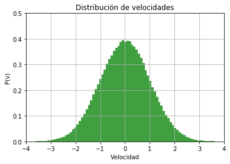


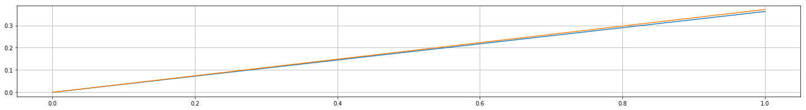


```python
#define tiempo (float)(10000)//Tiempo final aunque aquí en realidad es adimensional
#define dt (float)(0.001)//Paso en tiempo
#define Temperatura (float)(1)//Esto en realidad es energía pues hago T*k_b
#define dT (float)(0.001)//Paso de T*k_b
PosVel=pd.read_csv('Rk_Hist_dt0001.csv')
n, bins, patches = plt.hist(PosVel.loc[:,"z"], 95, density=True, facecolor='g', alpha=0.75)
plt.xlabel('P(z)')
plt.ylabel('z')
plt.title('Distribución Gaussiana')
plt.axis([-.25, .25, 0, 10])
plt.grid(True)
plt.show()
n, bins, patches = plt.hist(PosVel.loc[:,"Posicion"], 60, density=True, facecolor='g', alpha=0.75)
plt.xlabel('Posicion')
plt.ylabel('P(x)')
plt.title('Distribución de posiciones')
plt.axis([-4, 4, 0, 0.45])
plt.grid(True)
plt.show()
n, bins, patches = plt.hist(PosVel.loc[:,"Velocidad"], 100, density=True, facecolor='g', alpha=0.75)
plt.xlabel('Velocidad')
plt.ylabel('P(v)')
plt.title('Distribución de velocidades')
plt.axis([-4, 4, 0, 0.45])
plt.grid(True)
plt.show()
Equi=pd.read_csv('Rk_Equiparticion_dt0001.csv')
plt.figure(figsize=(25,3))
plt.plot(Equi.loc[:,"Temperatura"],Equi.loc[:,"Cinetica"])
plt.plot(Equi.loc[:,"Temperatura"],Equi.loc[:,"Potencial"])
plt.grid(True)
plt.show()
```


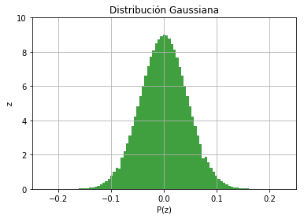


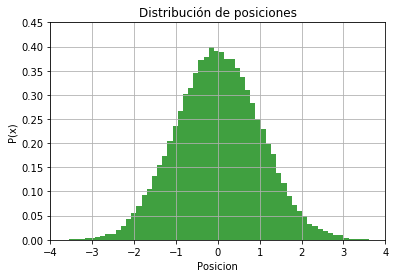


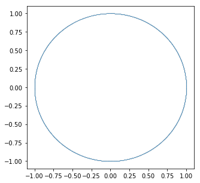


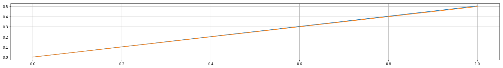


```python
#define tiempo (float)(10000)//Tiempo final aunque aquí en realidad es adimensional
#define dt (float)(0.01)//Paso en tiempo
#define Temperatura (float)(1)//Esto en realidad es energía pues hago T*k_b
#define dT (float)(0.001)//Paso de T*k_b
PosVel=pd.read_csv('Rk_Hist_dt001.csv')
n, bins, patches = plt.hist(PosVel.loc[:,"z"], 95, density=True, facecolor='g', alpha=0.75)
plt.xlabel('P(z)')
plt.ylabel('z')
plt.title('Distribución Gaussiana')
plt.axis([-.5, .5, 0, 3])
plt.grid(True)
plt.show()
n, bins, patches = plt.hist(PosVel.loc[:,"Posicion"], 60, density=True, facecolor='g', alpha=0.75)
plt.xlabel('Posicion')
plt.ylabel('P(x)')
plt.title('Distribución de posiciones')
plt.axis([-4, 4, 0, 0.45])
plt.grid(True)
plt.show()
n, bins, patches = plt.hist(PosVel.loc[:,"Velocidad"], 100, density=True, facecolor='g', alpha=0.75)
plt.xlabel('Velocidad')
plt.ylabel('P(v)')
plt.title('Distribución de velocidades')
plt.axis([-4, 4, 0, 0.45])
plt.grid(True)
plt.show()
Equi=pd.read_csv('Rk_Equiparticion_dt001.csv')
plt.figure(figsize=(25,3))
plt.plot(Equi.loc[:,"Temperatura"],Equi.loc[:,"Cinetica"])
plt.plot(Equi.loc[:,"Temperatura"],Equi.loc[:,"Potencial"])
plt.grid(True)
plt.show()
```


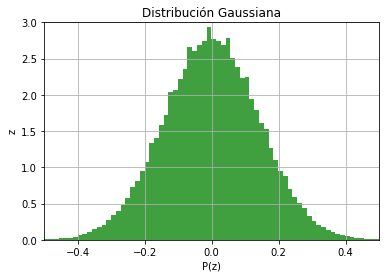


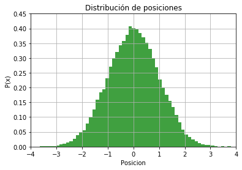


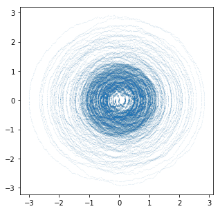


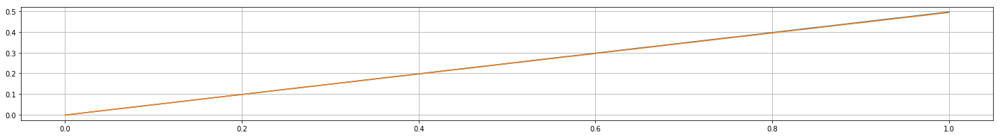


```python
#define tiempo (float)(10000)//Tiempo final aunque aquí en realidad es adimensional
#define dt (float)(0.01)//Paso en tiempo
PosVel=pd.read_csv('Rk_Hist_dt01.csv')
n, bins, patches = plt.hist(PosVel.loc[:,"z"], 95, density=True, facecolor='g', alpha=0.75)
plt.xlabel('P(z)')
plt.ylabel('z')
plt.title('Distribución Gaussiana')
plt.axis([-1.5, 1.5, 0, 1])
plt.grid(True)
plt.show()
n, bins, patches = plt.hist(PosVel.loc[:,"Posicion"], 60, density=True, facecolor='g', alpha=0.75)
plt.xlabel('Posicion')
plt.ylabel('P(x)')
plt.title('Distribución de posiciones')
plt.axis([-4, 4, 0, 0.45])
plt.grid(True)
plt.show()
n, bins, patches = plt.hist(PosVel.loc[:,"Velocidad"], 100, density=True, facecolor='g', alpha=0.75)
plt.xlabel('Velocidad')
plt.ylabel('P(v)')
plt.title('Distribución de velocidades')
plt.axis([-4, 4, 0, 0.45])
plt.grid(True)
plt.show()
Equi=pd.read_csv('Rk_Equiparticion_dt01.csv')
plt.figure(figsize=(25,3))
plt.plot(Equi.loc[:,"Temperatura"],Equi.loc[:,"Cinetica"])
plt.plot(Equi.loc[:,"Temperatura"],Equi.loc[:,"Potencial"])
plt.grid(True)
plt.show()
```


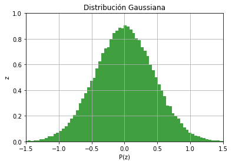


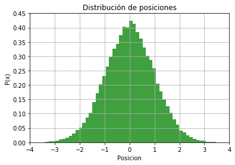


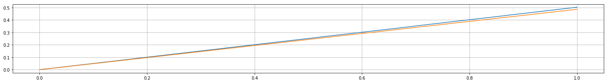


```python
#define tiempo (float)(1000)//Tiempo final aunque aquí en realidad es adimensional
#define dt (float)(0.01)//Paso en tiempo
#define Temperatura (float)(1)//Esto en realidad es energía pues hago T*k_b
#define dT (float)(0.001)//Paso de T*k_b
Pos=pd.read_csv('Rk_Eta0.csv')
plt.figure(figsize=(25,3))
plt.plot(Pos.loc[:,"Tiempo"],Pos.loc[:,"Posicion"])
plt.figure(figsize=(5,5))
plt.scatter(Pos.loc[:,"Posicion"],Pos.loc[:,"Velocidad"],s=0.001)
```


    <matplotlib.collections.PathCollection at 0x7fb5994776d8>


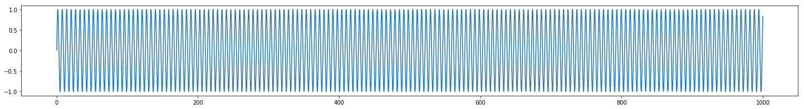


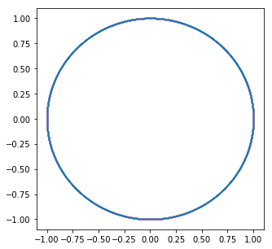


```python
#define tiempo (float)(1000)//Tiempo final aunque aquí en realidad es adimensional
#define dt (float)(0.01)//Paso en tiempo
#define Temperatura (float)(1)//Esto en realidad es energía pues hago T*k_b
#define dT (float)(0.001)//Paso de T*k_b
Pos=pd.read_csv('Rk_Eta001.csv')
plt.figure(figsize=(25,3))
plt.plot(Pos.loc[:,"Tiempo"],Pos.loc[:,"Posicion"])
plt.figure(figsize=(5,5))
plt.scatter(Pos.loc[:,"Posicion"],Pos.loc[:,"Velocidad"],s=0.001)
```


    <matplotlib.collections.PathCollection at 0x7fb59350af60>


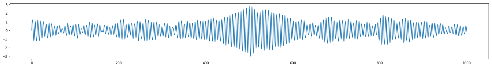


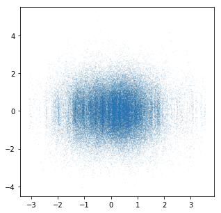


```python
#define tiempo (float)(1000)//Tiempo final aunque aquí en realidad es adimensional
#define dt (float)(0.01)//Paso en tiempo
#define Temperatura (float)(1)//Esto en realidad es energía pues hago T*k_b
#define dT (float)(0.001)//Paso de T*k_b
Pos=pd.read_csv('Rk_Eta01.csv')
plt.figure(figsize=(25,3))
plt.plot(Pos.loc[:,"Tiempo"],Pos.loc[:,"Posicion"])
plt.figure(figsize=(5,5))
plt.scatter(Pos.loc[:,"Posicion"],Pos.loc[:,"Velocidad"],s=0.001)
```


    <matplotlib.collections.PathCollection at 0x7fb599202240>


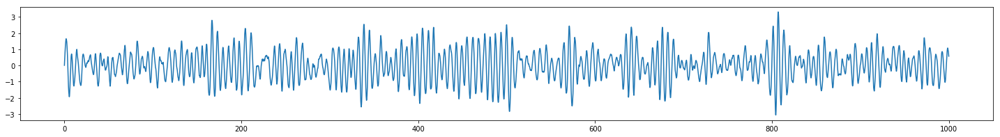


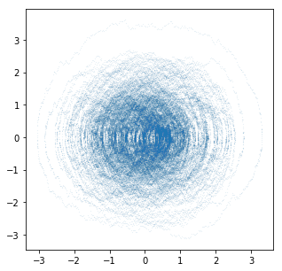


```python
#define tiempo (float)(1000)//Tiempo final aunque aquí en realidad es adimensional
#define dt (float)(0.01)//Paso en tiempo
#define Temperatura (float)(1)//Esto en realidad es energía pues hago T*k_b
#define dT (float)(0.001)//Paso de T*k_b
Pos=pd.read_csv('Rk_Eta1.csv')
plt.figure(figsize=(25,3))
plt.plot(Pos.loc[:,"Tiempo"],Pos.loc[:,"Posicion"])
plt.figure(figsize=(5,5))
plt.scatter(Pos.loc[:,"Posicion"],Pos.loc[:,"Velocidad"],s=0.001)
```


    <matplotlib.collections.PathCollection at 0x7fb593721d68>


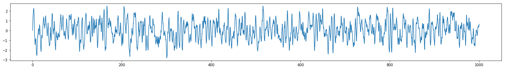


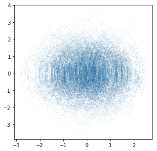


```python
#define tiempo (float)(1000)//Tiempo final aunque aquí en realidad es adimensional
#define dt (float)(0.01)//Paso en tiempo
#define Temperatura (float)(1)//Esto en realidad es energía pues hago T*k_b
#define dT (float)(0.001)//Paso de T*k_b
Pos=pd.read_csv('Rk_Eta10.csv')
plt.figure(figsize=(25,3))
plt.plot(Pos.loc[:,"Tiempo"],Pos.loc[:,"Posicion"])
plt.figure(figsize=(5,5))
plt.scatter(Pos.loc[:,"Posicion"],Pos.loc[:,"Velocidad"],s=0.001)
```


    <matplotlib.collections.PathCollection at 0x7fb593724668>


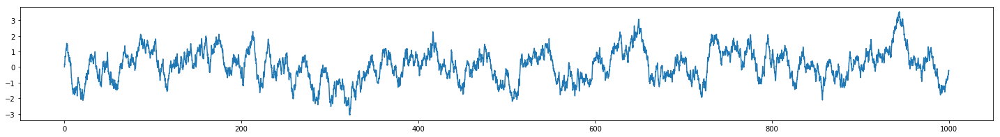


```python

```
